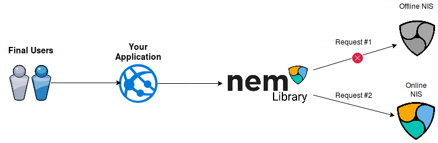

# Connection Pool

NEM Library handles the connections to the NEM Nodes (NIS) automatically.

## How to use it

We use `AccountHttp` for this example, but it works for every `*Http` class.

All `*Http` classes already use the Connection Pool by default. If no argument is passed into its constructor, the default NIS nodes will be used.
If you like to use your own NIS nodes, you could specify an array with the domain information.

Furthermore, the Connection Pool allows you to specify the protocol that you like to use in the second constructor argument.

```typescript
NEMLibrary.bootstrap(NetworkTypes.TEST_NET);
// Creates an AccountHttp instance with a pool of NIS nodes for TEST_NET
const accountHttpWithDefaultNodes = new AccountHttp();

// Using an AccountHttp with a custom NIS nodes
const accountHttpWithCustomNodes = new AccountHttp([
    {protocol: "http", domain: "192.3.61.243", port: 7890},
    {protocol: "http", domain: "23.228.67.85", port: 7890}
]);
```

In case you want to use a specific protocol, for example `HTTPS`, you can specify your preferred protocol in the `AccountHttp` constructor.

```typescript 
NEMLibrary.bootstrap(NetworkTypes.TEST_NET);
const accountHttpWithDefaultNodes = new AccountHttp(undefined, "https");
```

## How it works



1. The NEM Library starts the request to a NIS node.
2. If the request is successfull, the result is returned. If not, step 3.
3. The connection pool handles the connection error and tries the next available server.
