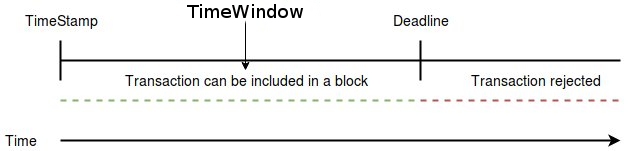

# Working examples

The guide section shows some *How to* use the NEM Library. 

You can find the code examples pre-configured and ready to use at [github.com/aleixmorgadas/nem-library-examples](https://github.com/aleixmorgadas/nem-library-examples)

### TimeWindow concept

The TimeWindow concept is related with the Transactions. A transaction has as *TimeWindow* where it can be included in a block,
once the deadline of the TimeWindow is after the Node timestamp, the transaction is rejected.

