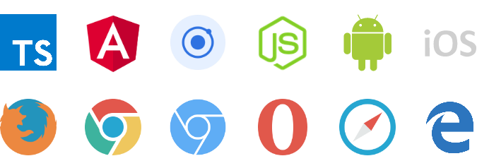

# Introduction

NEM Library is an abstraction for [NEM Blockchain][NEM-official] using a [Reactive](https://en.wikipedia.org/wiki/Reactive_programming) approach
for creating Blockchain applications.


#### stable version 0.6.0

Check the [npm repostory](https://www.npmjs.com/package/nem-library) for the latest updates

## Installation

```sh
npm install nem-library --save
```

NEM Library is build with [TypeScript Language][TS-lang], so be sure that you have 
the latest version installed.

We recommend to use TypeScript instead of JavaScript for building applications for 
[NEM Blockchain][NEM-official] due the type  system and how the nem-library is meant 
to be used, without counting other great benefits that TypeScript provides.

```sh
npm install -g typescript
```


## Platforms supported

| Platform | Version |
| ---      | ---     |
| [TypeScript][TS-lang] | \>= 2.4.0
| [NodeJS][NodeJS] | \>= 6.11.1 (but 8.x.x is recommended)|
| [Angular][Angular] | \>= 4.2 |
| [Ionic][Ionic] | \>= 4.0 |
| [Firefox][Firefox] | \>= 53.0|
| [Chrome][Chrome]| \>= 58.0.3029.81 |
| [Chromium][Chromium] | \>= 59.0.3071.86 |
| [Opera][Opera] | \>= 46.0.2597.46 |
| [Edge][Edge] | \>= 40.15063.0.0 | 
| [Safari][Safari] | \>= 10.0 |
| [Android](https://en.wikipedia.org/wiki/Android_(operating_system)) | \>= 5.0.0 |
| [iOS](https://en.wikipedia.org/wiki/IOS) | \>= 9.3.5 |

Because of Ionic generates mobile applications, Android and iOS, the support is provided.  
Remark that [Windows Phone](https://en.wikipedia.org/wiki/Windows_Phone) is not supported yet.
 


## TypeScript compiler options

Until nem-library upgrade into [RxJS 6.0](https://www.npmjs.com/package/rxjs), `"noStrictGenericChecks"` has to be set to true in `tsconfig.json` file.

```json
{
  "compilerOptions": {
    // ...
    "noStrictGenericChecks": true
  }
}
```

# Usage

THE SOFTWARE IS PROVIDED "AS IS", WITHOUT WARRANTY OF ANY KIND, EXPRESS OR
IMPLIED, INCLUDING BUT NOT LIMITED TO THE WARRANTIES OF MERCHANTABILITY, FITNESS
FOR A PARTICULAR PURPOSE AND NONINFRINGEMENT. IN NO EVENT SHALL THE AUTHORS OR
COPYRIGHT HOLDERS BE LIABLE FOR ANY CLAIM, DAMAGES OR OTHER LIABILITY, WHETHER
IN AN ACTION OF CONTRACT, TORT OR OTHERWISE, ARISING FROM, OUT OF OR IN
CONNECTION WITH THE SOFTWARE OR THE USE OR OTHER DEALINGS IN THE SOFTWARE.

## Changelog

### 0.6.1
- Added statics to XEM Mosaic model
- Added optional levy to MosaicTransferable
- Created MosaicService to calculate levy value of a Mosaic
- MosaicId has equals & description methods
- FIXED issue TransferTransaction. When sending mosaics and message wrong fee calculation.

### 0.6.0

- [**Connection Pool**](documentation/connection_pool.md)
- Created `AccountOwnedMosaicService`
- FIXED issue with Mosaics. Now a Mosaic can be created without a Levy

### 0.5.1 

**BRAKING CHANGES**

- Where you had `XEM(3)` now you should add the `new` apperator first -> `new XEM(3)`
- Where you had `mosaicHttp.getMosaicDefinitions`, now you should call `mosaicHttp.getAllMosaicsGivenNamespace`

**NEW FEATURES**

- TransactionHttp: Added getByHash method that returns a particular Transaction
- BrainPassword must be at least a 12 word password to avoid collitions
- SimpleWallet has readFromWLT & writeWLTFile methods to persist it
- BrainWallet has readFromWLT & writeWLTFile methods to persist it
- Wallet has static walletTypeGivenWLT(wlt: string): WalletType method
- Created WalletType enum
- MosaicHttp added getMosaicDefinition method
- MosaicHttp added getMosaicTransferableWithAmount method
- Created EcobitEco Mosaic model
- Created DimToken Mosaic model
- Created DimCoin Mosaic model

### 0.4.0

- Pagable<T> extends Subject<T>
- OutgoingTransactionsPageable extends Pageable<>
- AllTransactionsPageable extends Pageable<>
- Account decryptMessage method now returns PlainMessage: **No compatible with previus version**
- ProvisionNamespaceTransaction added static createSub(timeWindow: TimeWindow, parentNamespace: string, newNamespaceName: string): ProvisionNamespaceTransaction;
- ProvisionNamespaceTransaction added static method createRoot(timeWindow: TimeWindow, namespaceName: string): ProvisionNamespaceTransaction;
- PlainMessage return the text decoded if it is encoded in UTF8, else plain payload

### 0.3.8

- Listeners allow HTTPS protocol

### 0.3.7

- Compiled JS is es5
- Address trims the input

### 0.3.6

Released 29 July 2017

- FIXED Listeners reconnection

### 0.3.5

Released 28 July 2017

- FIXED ConfirmedTransactionListener: It emitted the same object three times.

### 0.3.4

Released 26 July 2017

- [AccountHttp.allTransactions](https://nemlibrary.com/documentation/account/#accounthttp-definition): Accepts pageSize as optional parameter. Between 5 and 100, default 10
- [AccountHttp.allTransactionsPaginated](https://nemlibrary.com/documentation/account/#accounthttp-definition): Accepts pageSize as optional parameter. Between 5 and 100, default 10
- [AccountHttp.incomingTransactions](https://nemlibrary.com/documentation/account/#accounthttp-definition): Accepts pageSize as optional parameter. Between 5 and 100, default 10
- [AccountHttp.incomingTransactionsPaginated](https://nemlibrary.com/documentation/account/#accounthttp-definition): Accepts pageSize as optional parameter. Between 5 and 100, default 10
- [AccountHttp.outgoingTransactions](https://nemlibrary.com/documentation/account/#accounthttp-definition): Accepts pageSize as optional parameter. Between 5 and 100, default 10
- [AccountHttp.outgoingTransactionsPaginated](https://nemlibrary.com/documentation/account/#accounthttp-definition): Accepts pageSize as optional parameter. Between 5 and 100, default 10

### 0.3.3

Released 26 July 2017

- Exported interface `Pageable`

### 0.3.2

Released 26 July 2017

- FIX Listeners on Browsers
- [Transaction Model](https://nemlibrary.com/documentation/transaction/#transaction): Changed `signer` field type from `string` to `Public Account`
- [Block Model](https://nemlibrary.com/documentation/blockchain/#block): Changed `signer` field type from `string` to `Public Account`
- [NodeIdentity Model](https://nemlibrary.com/documentation/node/#node): Replaced `publickey: string` field to `publicAccount: PublicAccount`

### 0.3.1

Released 24 July 2017

### 0.3.0-RC4

- Encrypted Message

### 0.3.0-RC1

- Pagination
- Listeners
- Wallets

### 0.2.34

Stable version

[TS-lang]: https://www.typescriptlang.org/
[NodeJS]: https://nodejs.org/en/
[Angular]: https://angular.io/
[Ionic]: http://ionicframework.com/
[NEM-official]: https://nem.io
[Firefox]: https://www.mozilla.org/en-US/firefox/new/
[Chrome]: https://www.google.com/chrome/index.html
[Chromium]: http://www.chromium.org/Home
[Opera]: http://www.opera.com/
[Edge]: https://www.microsoft.com/en-us/windows/microsoft-edge
[Safari]: https://www.apple.com/safari/